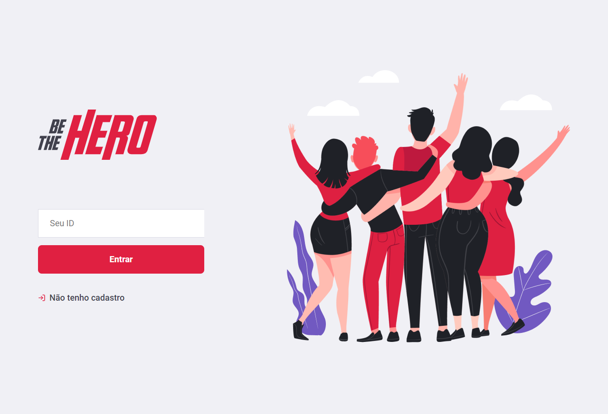
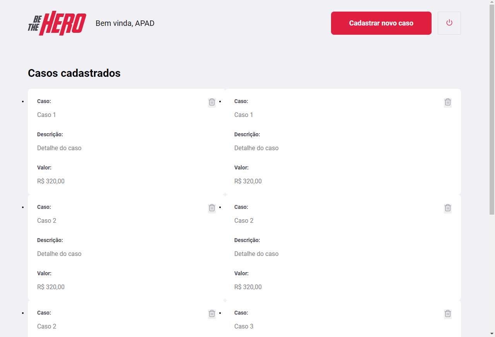
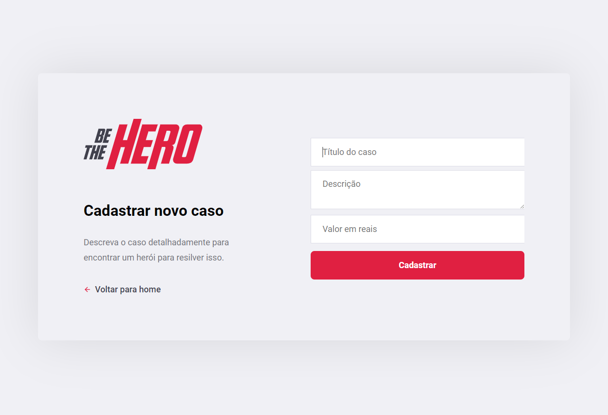

# ong

<h2>Requisitos</h2>
<ul>NodeJS</ul>

<h2>Como rodar a aplicação</h2>
<ul>
	No terminal, clone o projeto:
		<ul>$ git clone https://github.com/cleiltont/ong.git</ul>
</ul>

<ul>
	Entre na pasta backend para rodar o servidor
		<ul>$ cd backend</ul>
</ul>

<ul>
	Instale as dependências:
		<ul>$ yarn install</ul>
</ul>

<ul> 
	Execute a apulcação:
		<ul>$ yarn dev</ul>
</ul>

<ul> 
	Agora abra o terminal na pasta web e execute
		<ul>$ yarn start</ul>
</ul>

Pronto, agora é possível acessar a apulcação a partir da rota

     

Feito &nbsp; :heart: &nbsp; com by Cleilton Timotep.
